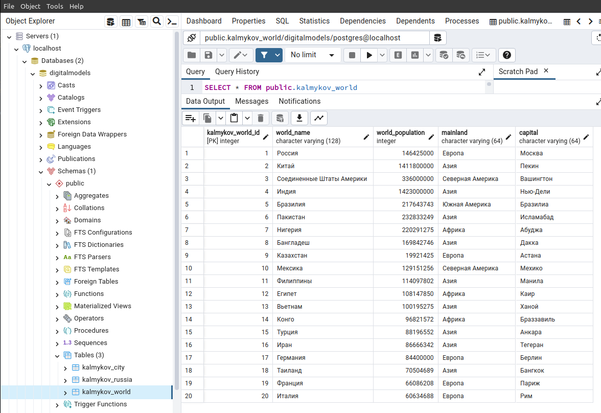
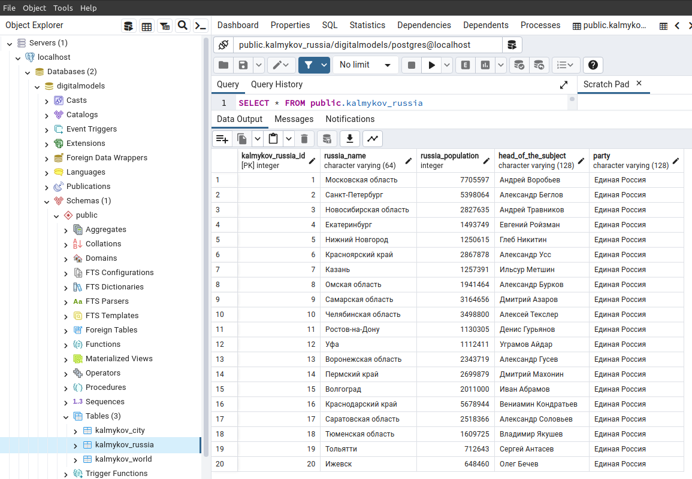
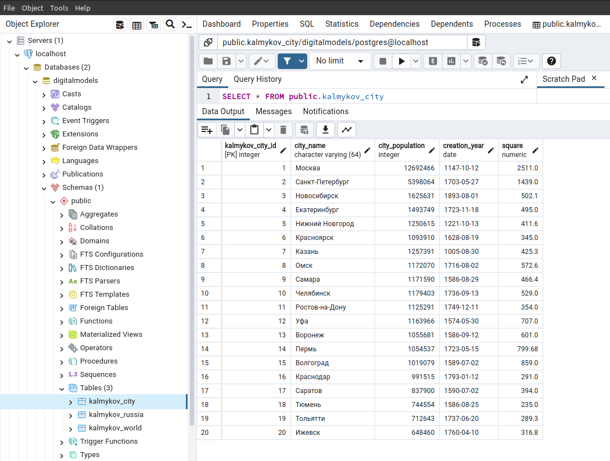

# Лабораторная работа №1

Задание:

Результат:

## Созадние базы данных через скрипт

    import os
    import psycopg2
    from dotenv import load_dotenv
    load_dotenv()
    
    
    HOST_DB = os.getenv('HOST_DB')
    PORT_DB = os.getenv('PORT_DB')
    USER_DB = os.getenv('USER_DB')
    NAME_DB = os.getenv('NAME_DB')
    PASSWORD_DB = os.getenv('PASSWORD_DB')

    def create_database(name):
        db_params = {
            "host": HOST_DB,
            "user": USER_DB,
            "password": PASSWORD_DB
        }
    
        create_database_query = f"CREATE DATABASE {name};"
        conn = psycopg2.connect(**db_params)
        conn.autocommit = True
        cursor = conn.cursor()
        cursor.execute(create_database_query)
        cursor.close()
        conn.close()
    
        db_params["database"] = name
    
        print(f"[INFO] База данных {name} успешно создана") 

    create_database('digitalmodels')

## Создание и заполнение таблиц через скрипт

    import os
    import psycopg2
    from dotenv import load_dotenv
    load_dotenv()
    
    
    HOST_DB = os.getenv('HOST_DB')
    PORT_DB = os.getenv('PORT_DB')
    USER_DB = os.getenv('USER_DB')
    NAME_DB = os.getenv('NAME_DB')
    PASSWORD_DB = os.getenv('PASSWORD_DB')

    
    def connection():
        try:
            connection = psycopg2.connect(
                host=HOST_DB,
                port=PORT_DB,
                user=USER_DB,
                password=PASSWORD_DB,
                database=NAME_DB
            )
            print('[INFO] Успешное подключение к базе данных', e)
    
        except Exception as e:
            print('[INFO] Ошибка в процессе подключения к базе данных', e)
        return connection
    
    
    def create_tables():
        conn = connection()
    
        # SQL-запросы для создания таблиц
        queries = [
            # страны
            """
            CREATE TABLE IF NOT EXISTS kalmykov_world (
                kalmykov_world_id SERIAL PRIMARY KEY,
                world_name VARCHAR(128),
                world_population INTEGER,
                mainland VARCHAR(64),
                capital VARCHAR(64)
            )
            """,
            # субъекты
            """
            CREATE TABLE IF NOT EXISTS kalmykov_russia (
                kalmykov_russia_id SERIAL PRIMARY KEY,
                russia_name VARCHAR(64),
                russia_population INTEGER,
                head_of_the_subject VARCHAR(128),
                party VARCHAR(128)
            )
            """,
            # города рф
            """
            CREATE TABLE IF NOT EXISTS kalmykov_city (
                kalmykov_city_id SERIAL PRIMARY KEY,
                city_name VARCHAR(64),
                city_population INTEGER,
                creation_year DATE,
                square DECIMAL
            )
            """
        ]
    
        # Создание таблиц
        with conn.cursor() as cursor:
            for query in queries:
                cursor.execute(query)
                conn.commit()
    
        print("[INFO] Таблицы успешно созданы")
        conn.close()
    
    
    def data_to_tables():
        conn = connection()
        
        kalmykov_world_data = [
            (1, 'Россия', 146_425_000, 'Европа', 'Москва'),
            (2, 'Китай', 1_411_800_000, 'Азия', 'Пекин'),
            (3, 'Соединенные Штаты Америки', 336_000_000, 'Северная Америка', 'Вашингтон'),
            (4, 'Индия', 1_423_000_000, 'Азия', 'Нью-Дели'),
            (5, 'Бразилия', 217_643_743, 'Южная Америка', 'Бразилиа'),
            (6, 'Пакистан', 232_833_249, 'Азия', 'Исламабад'),
            (7, 'Нигерия', 220_291_275, 'Африка', 'Абуджа'),
            (8, 'Бангладеш', 169_842_746, 'Азия', 'Дакка'),
            (9, 'Казахстан', 19_921_425, 'Европа', 'Астана'),
            (10, 'Мексика', 129_151_256, 'Северная Америка', 'Мехико'),
            (11, 'Филиппины', 114_097_802, 'Азия', 'Манила'),
            (12, 'Египет', 108_147_850, 'Африка', 'Каир'),
            (13, 'Вьетнам', 100_195_275, 'Азия', 'Ханой'),
            (14, 'Конго', 96_821_572, 'Африка', 'Браззавиль'),
            (15, 'Турция', 88_196_552, 'Азия', 'Анкара'),
            (16, 'Иран', 86_666_342, 'Азия', 'Тегеран'),
            (17, 'Германия', 84_400_000, 'Европа', 'Берлин'),
            (18, 'Таиланд', 70_504_689, 'Азия', 'Бангкок'),
            (19, 'Франция', 66_086_208, 'Европа', 'Париж'),
            (20, 'Италия', 60_634_688, 'Европа', 'Рим')
        ]
        insert_kalmykov_world_query = "INSERT INTO kalmykov_world (kalmykov_world_id, world_name, world_population, mainland, capital) VALUES (%s, %s, %s, %s, %s)"
    
        
        kalmykov_russia_data = [
            (1, 'Московская область', 7705597, 'Андрей Воробьев', 'Единая Россия'),
            (2, 'Санкт-Петербург', 5398064, 'Александр Беглов', 'Единая Россия'),
            (3, 'Новосибирская область', 2827635, 'Андрей Травников', 'Единая Россия'),
            (4, 'Екатеринбург', 1493749, 'Евгений Ройзман', 'Единая Россия'),
            (5, 'Нижний Новгород', 1250615, 'Глеб Никитин', 'Единая Россия'),
            (6, 'Красноярский край', 2867878, 'Александр Усс', 'Единая Россия'),
            (7, 'Казань', 1257391, 'Ильсур Метшин', 'Единая Россия'),
            (8, 'Омская область', 1941464, 'Александр Бурков', 'Единая Россия'),
            (9, 'Самарская область', 3164656, 'Дмитрий Азаров', 'Единая Россия'),
            (10, 'Челябинская область', 3498800, 'Алексей Текслер', 'Единая Россия'),
            (11, 'Ростов-на-Дону', 1130305, 'Денис Гурьянов', 'Единая Россия'),
            (12, 'Уфа', 1112411, 'Уграмов Айдар', 'Единая Россия'),
            (13, 'Воронежская область', 2343719, 'Александр Гусев', 'Единая Россия'),
            (14, 'Пермский край', 2699879, 'Дмитрий Махонин', 'Единая Россия'),
            (15, 'Волгоград', 2011000, 'Иван Абрамов', 'Единая Россия'),
            (16, 'Краснодарский край', 5678944, 'Вениамин Кондратьев', 'Единая Россия'),
            (17, 'Саратовская область', 2518366, 'Александр Соловьев', 'Единая Россия'),
            (18, 'Тюменская область', 1609725, 'Владимир Якушев', 'Единая Россия'),
            (19, 'Тольятти', 712643, 'Сергей Антасев', 'Единая Россия'),
            (20, 'Ижевск', 648460, 'Олег Бечев', 'Единая Россия')
        ]
        insert_kalmykov_russia_query = "INSERT INTO kalmykov_russia (kalmykov_russia_id, russia_name, russia_population, head_of_the_subject, party) VALUES (%s, %s, %s, %s, %s)"

        
        kalmykov_city_data = [
            (1, 'Москва', 12692466, '1147-10-12', 2511.0),
            (2, 'Санкт-Петербург', 5398064, '1703-05-27', 1439.0),
            (3, 'Новосибирск', 1625631, '1893-08-01', 502.1),
            (4, 'Екатеринбург', 1493749, '1723-11-18', 495.0),
            (5, 'Нижний Новгород', 1250615, '1221-10-13', 411.6),
            (6, 'Красноярск', 1093910, '1628-08-19', 345.0),
            (7, 'Казань', 1257391, '1005-08-30', 425.3),
            (8, 'Омск', 1172070, '1716-08-02', 572.6),
            (9, 'Самара', 1171590, '1586-08-29', 466.4),
            (10, 'Челябинск', 1179403, '1736-09-13', 529.0),
            (11, 'Ростов-на-Дону', 1125291, '1749-12-11', 354.0),
            (12, 'Уфа', 1163966, '1574-05-30', 707.0),
            (13, 'Воронеж', 1055681, '1586-09-12', 601.0),
            (14, 'Пермь', 1054537, '1723-05-15', 799.68),
            (15, 'Волгоград', 1019079, '1589-07-02', 859.0),
            (16, 'Краснодар', 991515, '1793-01-12', 291.0),
            (17, 'Саратов', 837900, '1590-07-02', 394.0),
            (18, 'Тюмень', 744554, '1586-08-25', 235.0),
            (19, 'Тольятти', 712643, '1737-06-20', 289.3),
            (20, 'Ижевск', 648460, '1760-04-10', 316.8)
        ]
        insert_kalmykov_city_query = "INSERT INTO kalmykov_city (kalmykov_city_id, city_name, city_population, creation_year, square) VALUES (%s, %s, %s, %s, %s)"
    
        # Добавление данных
        with conn.cursor() as cursor:
            cursor.executemany(insert_kalmykov_world_query, kalmykov_world_data)
            cursor.executemany(insert_kalmykov_russia_query, kalmykov_russia_data)
            cursor.executemany(insert_kalmykov_city_query, kalmykov_city_data)
            conn.commit()
    
        print("[INFO] Данные в таблицы успешно добавлены")
        conn.close()
    

    create_tables()
    data_to_tables()

## Заполненная таблица kalmykov_world

## Заполненная таблица kalmykov_russia

## Заполненная таблица kalmykov_city

