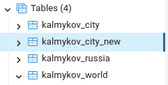
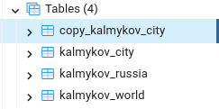
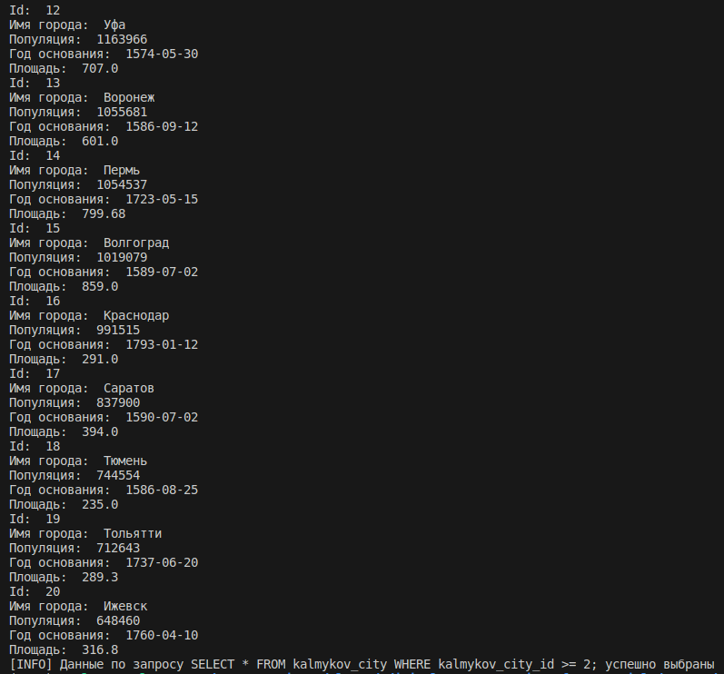
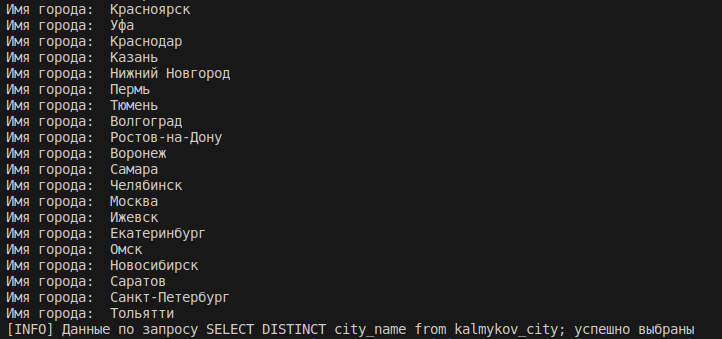
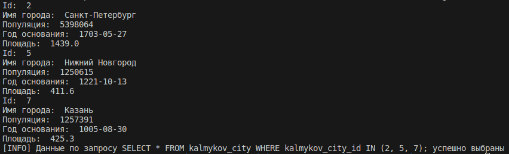
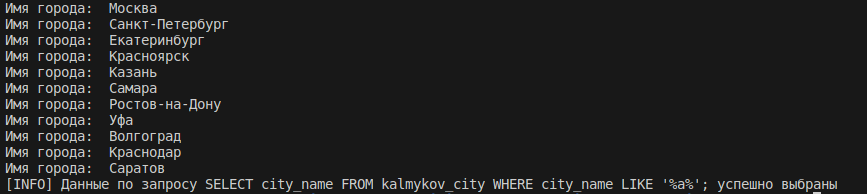
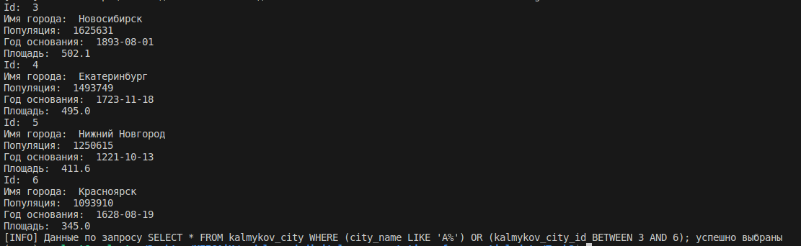

# Лабораторная работа №2

Задание:

Результат:

## Пункт 1.1.

    import os
    import psycopg2
    from dotenv import load_dotenv
    load_dotenv()
    
    
    HOST_DB = os.getenv('HOST_DB')
    PORT_DB = os.getenv('PORT_DB')
    USER_DB = os.getenv('USER_DB')
    NAME_DB = os.getenv('NAME_DB')
    PASSWORD_DB = os.getenv('PASSWORD_DB')

    def connection():
        try:
            connection = psycopg2.connect(
                host=HOST_DB,
                port=PORT_DB,
                user=USER_DB,
                password=PASSWORD_DB,
                database=NAME_DB
            )
            print('[INFO] Успешное подключение к базе данных', e)
    
        except Exception as e:
            print('[INFO] Ошибка в процессе подключения к базе данных', e)
        return connection

    def copy_table():
        conn = connection()
        query = "SELECT * INTO kalmykov_city_new FROM kalmykov_city;"
        with conn.cursor() as cursor:
            cursor.execute(query)
            conn.commit()
    
        print("[INFO] Таблица успешно скопированы")
        conn.close()

## Пункт 1.2.

    import os
    import psycopg2
    from dotenv import load_dotenv
    load_dotenv()
    
    
    HOST_DB = os.getenv('HOST_DB')
    PORT_DB = os.getenv('PORT_DB')
    USER_DB = os.getenv('USER_DB')
    NAME_DB = os.getenv('NAME_DB')
    PASSWORD_DB = os.getenv('PASSWORD_DB')

    def connection():
        try:
            connection = psycopg2.connect(
                host=HOST_DB,
                port=PORT_DB,
                user=USER_DB,
                password=PASSWORD_DB,
                database=NAME_DB
            )
            print('[INFO] Успешное подключение к базе данных', e)
    
        except Exception as e:
            print('[INFO] Ошибка в процессе подключения к базе данных', e)
        return connection

    def rename_table():
        conn = connection()
        query = "ALTER TABLE kalmykov_city_new RENAME TO copy_kalmykov_city;"
        with conn.cursor() as cursor:
            cursor.execute(query)
            conn.commit()
    
        print("[INFO] Имя таблицы успешно изменено")
        conn.close()

## Пункт 1.3.

    import os
    import psycopg2
    from dotenv import load_dotenv
    load_dotenv()
    
    
    HOST_DB = os.getenv('HOST_DB')
    PORT_DB = os.getenv('PORT_DB')
    USER_DB = os.getenv('USER_DB')
    NAME_DB = os.getenv('NAME_DB')
    PASSWORD_DB = os.getenv('PASSWORD_DB')

    def connection():
        try:
            connection = psycopg2.connect(
                host=HOST_DB,
                port=PORT_DB,
                user=USER_DB,
                password=PASSWORD_DB,
                database=NAME_DB
            )
            print('[INFO] Успешное подключение к базе данных', e)
    
        except Exception as e:
            print('[INFO] Ошибка в процессе подключения к базе данных', e)
        return connection

    def delete_table():
        conn = connection()
        query = "DROP TABLE copy_kalmykov_city;"
        with conn.cursor() as cursor:
            cursor.execute(query)
            conn.commit()
    
        print("[INFO] Таблица успешно удалена")
        conn.close()

## Пункт 4.1.

    import os
    import psycopg2
    from dotenv import load_dotenv
    load_dotenv()
    
    
    HOST_DB = os.getenv('HOST_DB')
    PORT_DB = os.getenv('PORT_DB')
    USER_DB = os.getenv('USER_DB')
    NAME_DB = os.getenv('NAME_DB')
    PASSWORD_DB = os.getenv('PASSWORD_DB')

    def connection():
        try:
            connection = psycopg2.connect(
                host=HOST_DB,
                port=PORT_DB,
                user=USER_DB,
                password=PASSWORD_DB,
                database=NAME_DB
            )
            print('[INFO] Успешное подключение к базе данных', e)
    
        except Exception as e:
            print('[INFO] Ошибка в процессе подключения к базе данных', e)
        return connection

    def viborka1():
        conn = connection()
        query = "SELECT * FROM kalmykov_city WHERE kalmykov_city_id >= 2;"
        with conn.cursor() as cursor:
            cursor.execute(query)
            output = cursor.fetchall()
            for row in output:
                print("Id: ", row[0])
                print("Имя города: ", row[1])
                print("Популяция: ", row[2])
                print("Год основания: ", row[3])
                print("Площадь: ", row[4])
    
        print(f"[INFO] Данные по запросу {query} успешно выбраны")
        conn.close()

## Пункт 4.2.

    import os
    import psycopg2
    from dotenv import load_dotenv
    load_dotenv()
    
    
    HOST_DB = os.getenv('HOST_DB')
    PORT_DB = os.getenv('PORT_DB')
    USER_DB = os.getenv('USER_DB')
    NAME_DB = os.getenv('NAME_DB')
    PASSWORD_DB = os.getenv('PASSWORD_DB')

    def connection():
        try:
            connection = psycopg2.connect(
                host=HOST_DB,
                port=PORT_DB,
                user=USER_DB,
                password=PASSWORD_DB,
                database=NAME_DB
            )
            print('[INFO] Успешное подключение к базе данных', e)
    
        except Exception as e:
            print('[INFO] Ошибка в процессе подключения к базе данных', e)
        return connection

    def viborka2():
        conn = connection()
        query = "SELECT DISTINCT city_name from kalmykov_city;"
        with conn.cursor() as cursor:
            cursor.execute(query)
            output = cursor.fetchall()
            for row in output:
                print(f"Имя города: ", row[0])
    
        print(f"[INFO] Данные по запросу {query} успешно выбраны")
        conn.close()

## Пункт 4.3.

    import os
    import psycopg2
    from dotenv import load_dotenv
    load_dotenv()
    
    
    HOST_DB = os.getenv('HOST_DB')
    PORT_DB = os.getenv('PORT_DB')
    USER_DB = os.getenv('USER_DB')
    NAME_DB = os.getenv('NAME_DB')
    PASSWORD_DB = os.getenv('PASSWORD_DB')

    def connection():
        try:
            connection = psycopg2.connect(
                host=HOST_DB,
                port=PORT_DB,
                user=USER_DB,
                password=PASSWORD_DB,
                database=NAME_DB
            )
            print('[INFO] Успешное подключение к базе данных', e)
    
        except Exception as e:
            print('[INFO] Ошибка в процессе подключения к базе данных', e)
        return connection

    def viborka3():
        conn = connection()
        query = "SELECT * FROM kalmykov_city WHERE kalmykov_city_id IN (2, 5, 7);"
        with conn.cursor() as cursor:
            cursor.execute(query)
            output = cursor.fetchall()
            for row in output:
                print("Id: ", row[0])
                print("Имя города: ", row[1])
                print("Популяция: ", row[2])
                print("Год основания: ", row[3])
                print("Площадь: ", row[4])
    
        print(f"[INFO] Данные по запросу {query} успешно выбраны")
        conn.close()

## Пункт 2.4.

    import os
    import psycopg2
    from dotenv import load_dotenv
    load_dotenv()
    
    
    HOST_DB = os.getenv('HOST_DB')
    PORT_DB = os.getenv('PORT_DB')
    USER_DB = os.getenv('USER_DB')
    NAME_DB = os.getenv('NAME_DB')
    PASSWORD_DB = os.getenv('PASSWORD_DB')

    def connection():
        try:
            connection = psycopg2.connect(
                host=HOST_DB,
                port=PORT_DB,
                user=USER_DB,
                password=PASSWORD_DB,
                database=NAME_DB
            )
            print('[INFO] Успешное подключение к базе данных', e)
    
        except Exception as e:
            print('[INFO] Ошибка в процессе подключения к базе данных', e)
        return connection

    def viborka4():
        conn = connection()
        query = "SELECT city_name FROM kalmykov_city WHERE city_name LIKE '%а%';"
        with conn.cursor() as cursor:
            cursor.execute(query)
            output = cursor.fetchall()
            for row in output:
                print("Имя города: ", row[0])
    
        print(f"[INFO] Данные по запросу {query} успешно выбраны")
        conn.close()

## Пункт 2.5.

    import os
    import psycopg2
    from dotenv import load_dotenv
    load_dotenv()
    
    
    HOST_DB = os.getenv('HOST_DB')
    PORT_DB = os.getenv('PORT_DB')
    USER_DB = os.getenv('USER_DB')
    NAME_DB = os.getenv('NAME_DB')
    PASSWORD_DB = os.getenv('PASSWORD_DB')

    def connection():
        try:
            connection = psycopg2.connect(
                host=HOST_DB,
                port=PORT_DB,
                user=USER_DB,
                password=PASSWORD_DB,
                database=NAME_DB
            )
            print('[INFO] Успешное подключение к базе данных', e)
    
        except Exception as e:
            print('[INFO] Ошибка в процессе подключения к базе данных', e)
        return connection

    def viborka5():
        conn = connection()
        query = "SELECT * FROM kalmykov_city WHERE (city_name LIKE 'A%') OR (kalmykov_city_id BETWEEN 3 AND 6);"
        with conn.cursor() as cursor:
            cursor.execute(query)
            output = cursor.fetchall()
            for row in output:
                print("Id: ", row[0])
                print("Имя города: ", row[1])
                print("Популяция: ", row[2])
                print("Год основания: ", row[3])
                print("Площадь: ", row[4])
    
        print(f"[INFO] Данные по запросу {query} успешно выбраны")
        conn.close()

