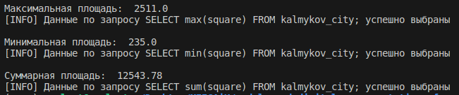
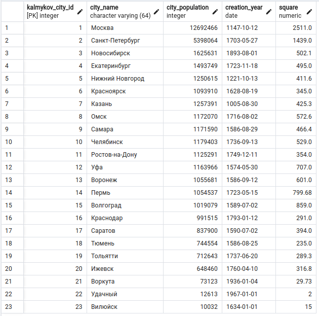
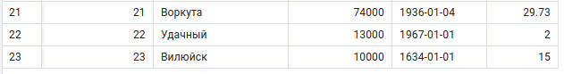
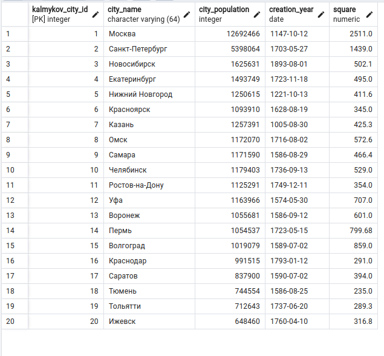

# Лабораторная работа №3

Задание:

1. Использовать в выборке не менее 3 агрегатных функций;
2. Вставить не менее 3 уникальных строк;
3. Обновить все вставленные строки;
4. Удалить все вставленные строки;

Сохранить весь скрипт в файле как 3.sql

Результат:

**Повторяющийся код:**

    import os
    import psycopg2
    from dotenv import load_dotenv
    load_dotenv()
    
    
    HOST_DB = os.getenv('HOST_DB')
    PORT_DB = os.getenv('PORT_DB')
    USER_DB = os.getenv('USER_DB')
    NAME_DB = os.getenv('NAME_DB')
    PASSWORD_DB = os.getenv('PASSWORD_DB')

    def connection():
        try:
            connection = psycopg2.connect(
                host=HOST_DB,
                port=PORT_DB,
                user=USER_DB,
                password=PASSWORD_DB,
                database=NAME_DB
            )
            print('[INFO] Успешное подключение к базе данных', e)
    
        except Exception as e:
            print('[INFO] Ошибка в процессе подключения к базе данных', e)
        return connection

**Далее функции, выполняющие заданные запросы к БД**

## Пункт 1.

    def p11():
        conn = connection()
        query = "SELECT max(square) FROM kalmykov_city;"
        with conn.cursor() as cursor:
            cursor.execute(query)
            output = cursor.fetchone()
            for row in output:
                print("Максимальная площадь: ", row)
    
        print(f"[INFO] Данные по запросу {query} успешно выбраны")
        conn.close()

    def p12():
        conn = connection()
        query = "SELECT min(square) FROM kalmykov_city;"
        with conn.cursor() as cursor:
            cursor.execute(query)
            output = cursor.fetchone()
            for row in output:
                print("Минимальная площадь: ", row)
    
        print(f"[INFO] Данные по запросу {query} успешно выбраны")
        conn.close()

    def p13():
        conn = connection()
        query = "SELECT sum(square) FROM kalmykov_city;"
        with conn.cursor() as cursor:
            cursor.execute(query)
            output = cursor.fetchone()
            for row in output:
                print("Суммарная площадь: ", row)
    
        print(f"[INFO] Данные по запросу {query} успешно выбраны")
        conn.close()

## Пункт 2.

    def p2():
        conn = connection()
        query = "INSERT INTO kalmykov_city (kalmykov_city_id, city_name, city_population, creation_year, square) VALUES (21, 'Воркута', 73123, '1936-01-04', 29.73), (22, 'Удачный', 12613, '1967-01-01', 2), (23, 'Вилюйск', 10032, '1634-01-01', 15);"
        with conn.cursor() as cursor:
            cursor.execute(query)
    
        print(f"[INFO] Данные по запросу {query} успешно добавлены")
        conn.close()

## Пункт 3.

    def p3():
        conn = connection()
        queries = ["UPDATE kalmykov_city SET city_population = 74000 WHERE kalmykov_city_id = 21;",
                "UPDATE kalmykov_city SET city_population = 13000 WHERE kalmykov_city_id = 22;",
                "UPDATE kalmykov_city SET city_population = 10000 WHERE kalmykov_city_id = 23;"]
        with conn.cursor() as cursor:
            for q in queries:
                cursor.execute(q)
                conn.commit()
    
        print(f"[INFO] Данные по запросам успешно обновлены")
        conn.close()

## Пункт 4.

    def p4():
        conn = connection()
        query = "DELETE FROM kalmykov_city WHERE kalmykov_city_id IN (21, 22, 23);"
        with conn.cursor() as cursor:
            cursor.execute(query)
            conn.commit()
    
        print(f"[INFO] Данные по запросам успешно удалены")
        conn.close()

