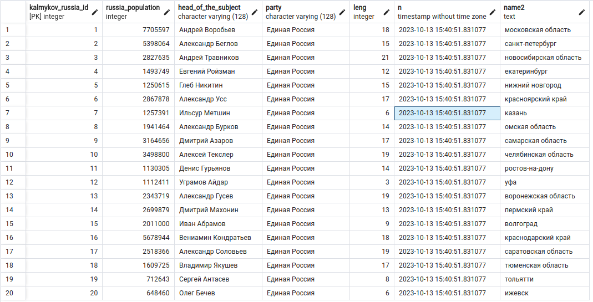

# Лабораторная работа №3

Задание:

1. Создать колонку “leng” и записать туда количество символов в столбце “Name” построчно
2. Создать колонку “segod” и записать туда текущее время и дату
3. Переименовать колонку “segod” в “N”
4. Создать колонку “Name2” и записать туда данные из колонки “Name” в нижнем регистре
5. Удалить колонку “Name”

Сохранить весь скрипт в файле как 4.sql + скрины

Результат:

    conn = psycopg2.connect(
        host=HOST_DB,
        port=PORT_DB,
        user=USER_DB,
        password=PASSWORD_DB,
        database=NAME_DB
    )
    
    cur = conn.cursor()

    # 1. Создать колонку "leng" и записать туда количество символов в столбце "Name" построчно
    cur.execute('ALTER TABLE kalmykov_russia ADD COLUMN leng INTEGER')
    cur.execute('UPDATE kalmykov_russia SET leng = LENGTH(russia_name)')
    conn.commit()
    time.sleep(10)
    print("Пункт 1 выполнен")

    # 2. Создать колонку "segod" и записать туда текущее время и дату
    cur.execute('ALTER TABLE kalmykov_russia ADD COLUMN segod TIMESTAMP')
    cur.execute('UPDATE kalmykov_russia SET segod = %s', (datetime.now(),))
    conn.commit()
    time.sleep(10)
    print("Пункт 2 выполнен")

    # 3. Переименовать колонку "segod" в "N"
    cur.execute('ALTER TABLE kalmykov_russia RENAME COLUMN segod TO N')
    conn.commit()
    time.sleep(10)
    print("Пункт 3 выполнен")

    # 4. Создать колонку "Name2" и записать туда данные из колонки "Name" в нижнем регистре
    cur.execute('ALTER TABLE kalmykov_russia ADD COLUMN Name2 TEXT')
    cur.execute('UPDATE kalmykov_russia SET Name2 = LOWER(russia_name)')
    conn.commit()
    time.sleep(10)
    print("Пункт 4 выполнен")

    # 5. Удалить колонку "Name"
    cur.execute('ALTER TABLE kalmykov_russia DROP COLUMN russia_name')
    conn.commit()
    print("Пункт 5 выполнен")

    cur.close()
    conn.close()

