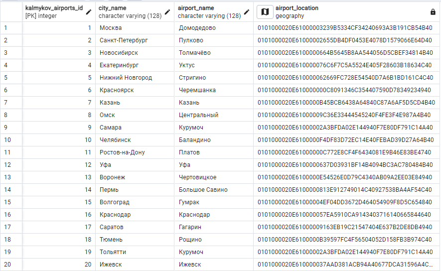
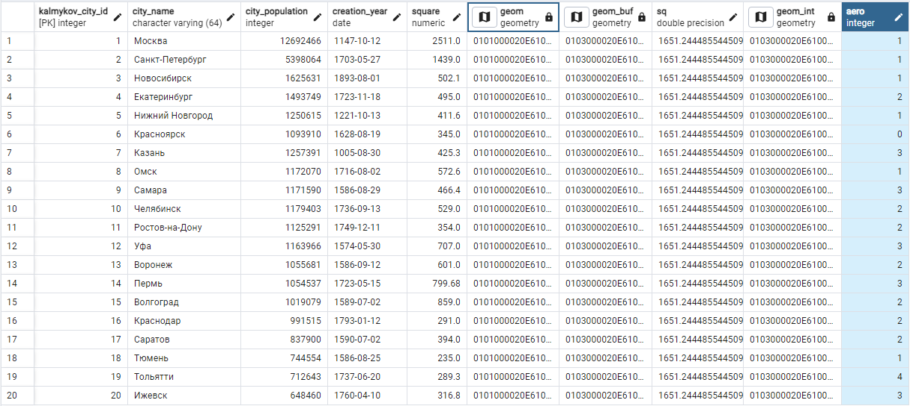

# Лабораторная работа №6

Задание:

Города, аэропорты и координаты:

'Москва' - 'Домодедово' - 37.900763 55.414920

'Санкт-Петербург' - 'Пулково' - 30.273198 59.800005

'Новосибирск' - 'Толмачёво' - 82.667497 55.009428

'Екатеринбург' - 'Уктус' - 60.645684 56.774177

'Нижний Новгород' - 'Стригино' - 43.790307 56.219444

'Красноярск' - 'Черемшанка' - 83.051152 50.275681

'Казань' - 'Казань' - 49.298596 55.608092

'Омск' - 'Центральный' - 73.316663 54.957773

'Самара' - 'Курумоч' - 50.157673 53.512267

'Челябинск' - 'Баландино' - 61.509242 55.298084

'Ростов-на-Дону' - 'Платов' - 39.929338 47.488386

'Уфа' - 'Уфа' - 55.883654 54.566430

'Воронеж' - 'Чертовицкое' - 39.225338 51.812620

'Пермь' - 'Большое Савино' - 56.010045 57.916343

'Волгоград' - 'Гумрак' - 44.354731 48.791887

'Краснодар' - 'Краснодар' - 39.138979 45.034333

'Саратов' - 'Гагарин' - 46.169986 51.718023

'Тюмень' - 'Рощино' - 65.348632 57.181518

'Тольятти' - 'Курумоч' - 50.157673 53.512267

'Ижевск' - 'Ижевск' - 53.450577 56.830847

Использованные команды:

    2. 
        ALTER TABLE public.kalmykov_airports ADD COLUMN airport_location geometry;

    3.  
        UPDATE public.kalmykov_airports
        SET airport_location = geometry('SRID=4326; POINT(37.900763 55.414920)')
        WHERE kalmykov_airports_id = 1;

    4. 
        CREATE INDEX ON public.kalmykov_airports USING gist(airport_location);

    5. 
        ALTER TABLE public.kalmykov_city ADD COLUMN aero INTEGER;

    6.
        UPDATE public.kalmykov_city
        SET aero = (SELECT count(*)
        FROM public.kalmykov_airports as a
        JOIN public.kalmykov_city as buf ON st_contains(buf.geom_buf, a.airport_location)
        WHERE buf."kalmykov_city_id"=1)
        WHERE kalmykov_city_id=1;

