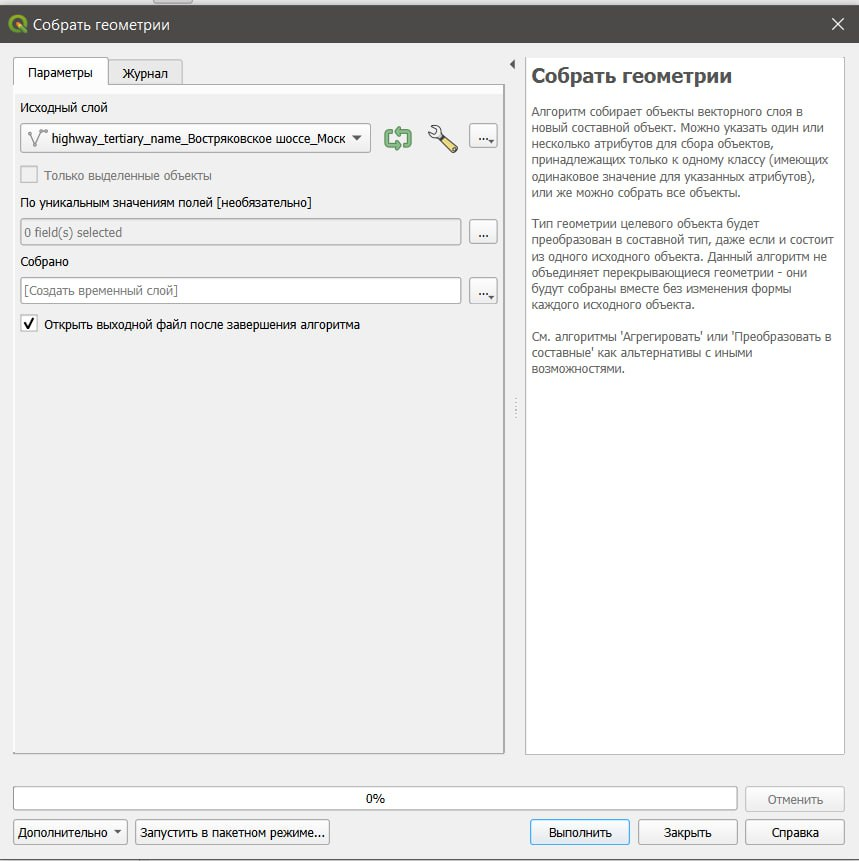
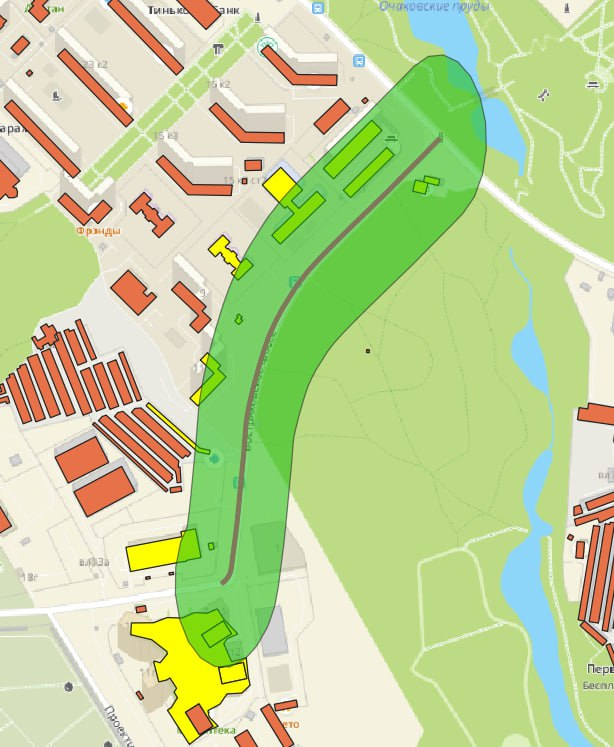

# Задание:

Из-за резкого увеличения трафика градостроители хотят расширить главную дорогу и добавить еще одну полосу движения. Создайте буфер вокруг дороги и найдите объекты, попадающие в буферную зону.

# Вариант 11: Востряковское шоссе

## **Добавим шоссе на карту**

## **Добавляем здания в радиусе 1500м**

## **Объединение объектов дороги**

## **Создание буферной зоны**

## **Выборка**

## **Калькулятор полей**

 
 
## **Макет буферной зоны**

 