# Задание: 

Для контроля проведения санкционированного собрания жильцов полиция хочет создать нейтральную зону, чтобы участники собрания держались на расстоянии не менее 100 метров от определенного здания. Создайте буферную зону вокруг здания и раскрасьте его, чтобы организаторы мероприятий могли видеть, где находится буферная зона.

# Вариант 2: Фруктовая улица, 9А

## **Добавляем на карту улицу и дом**

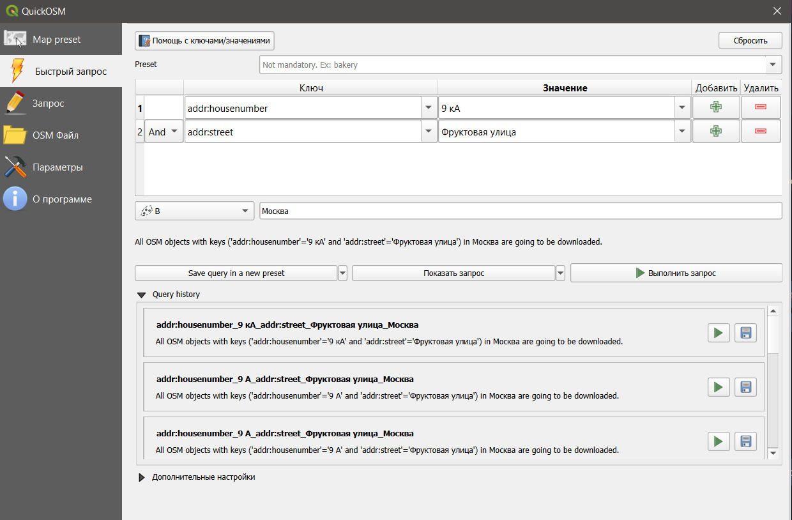
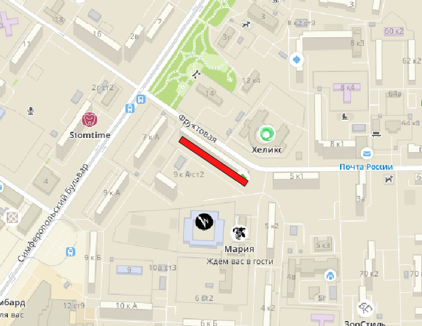

## **Создаем центроид**

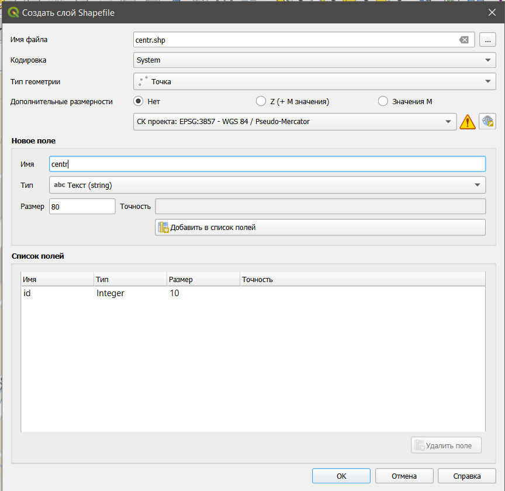
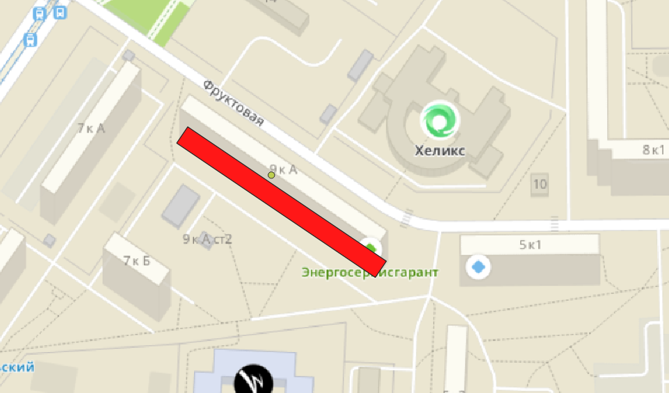

## **Создание буферной зоны**

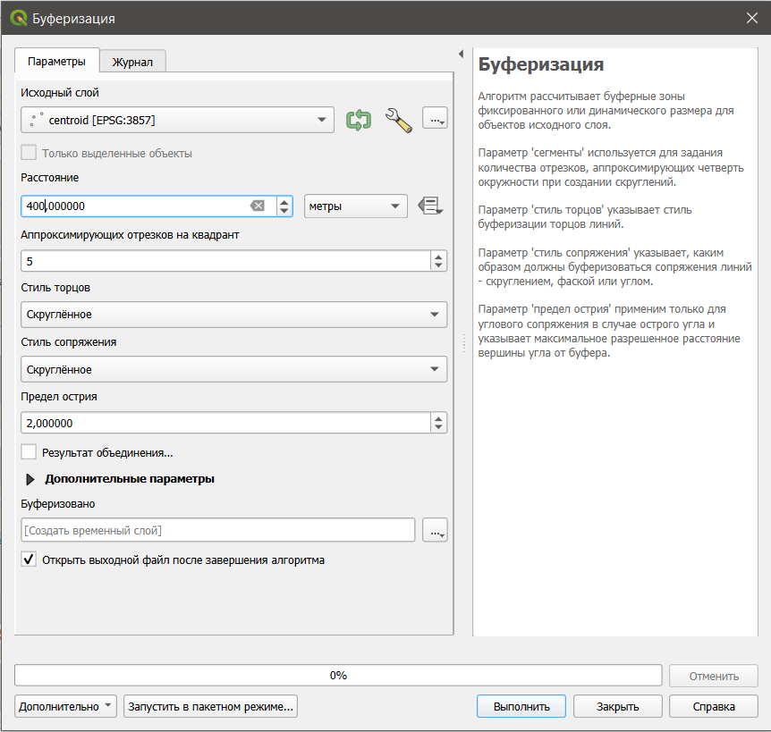
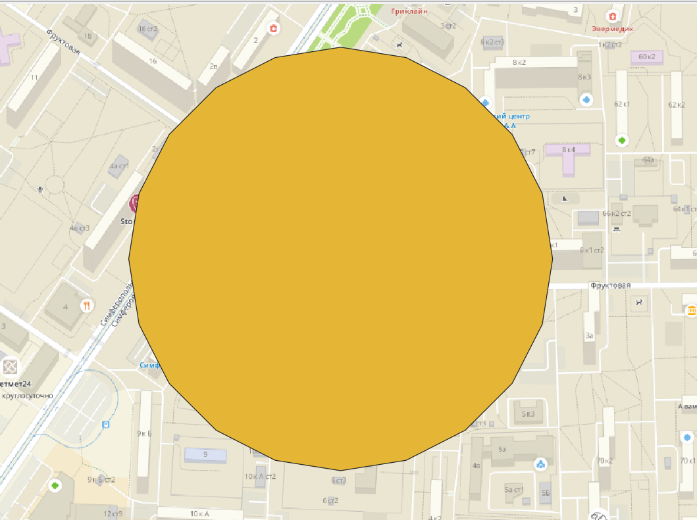

## **Добавление домов во круг в радиусе 2000 м**

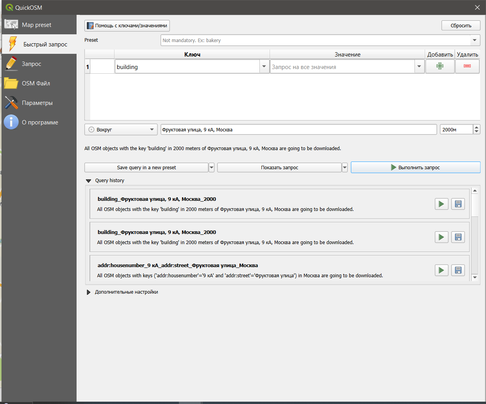
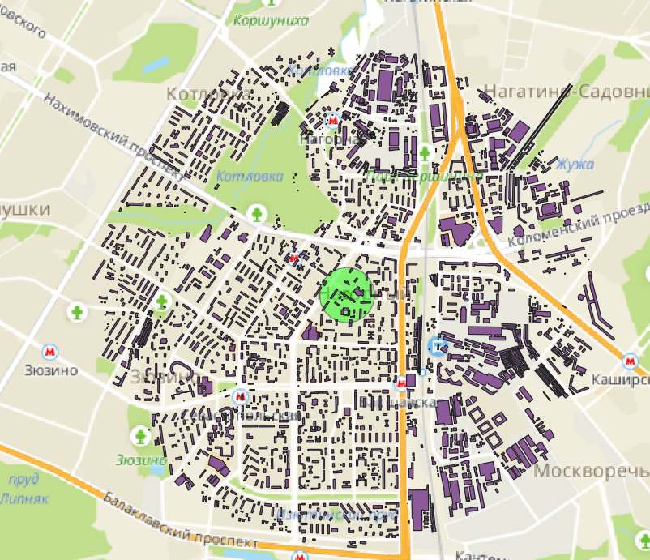

## **Выделяем здания пересекающие буферную зону и не пересекающие буферную зону**

**Пересекает буферной зону**

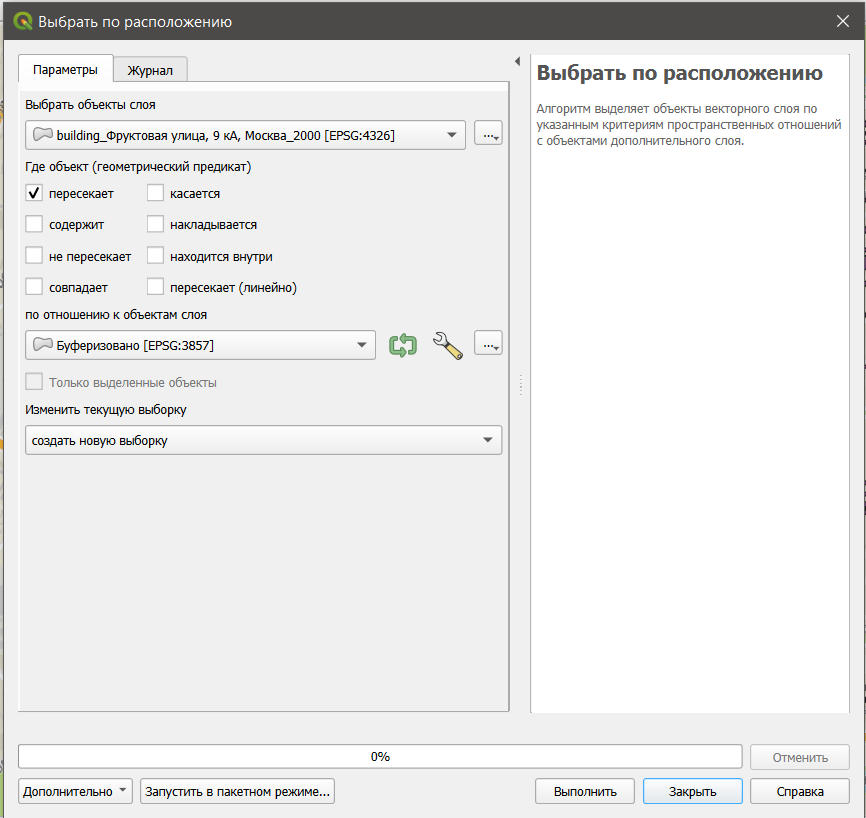
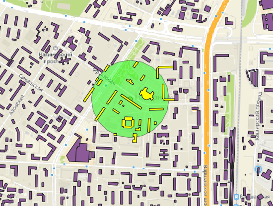

**Не пересекает**

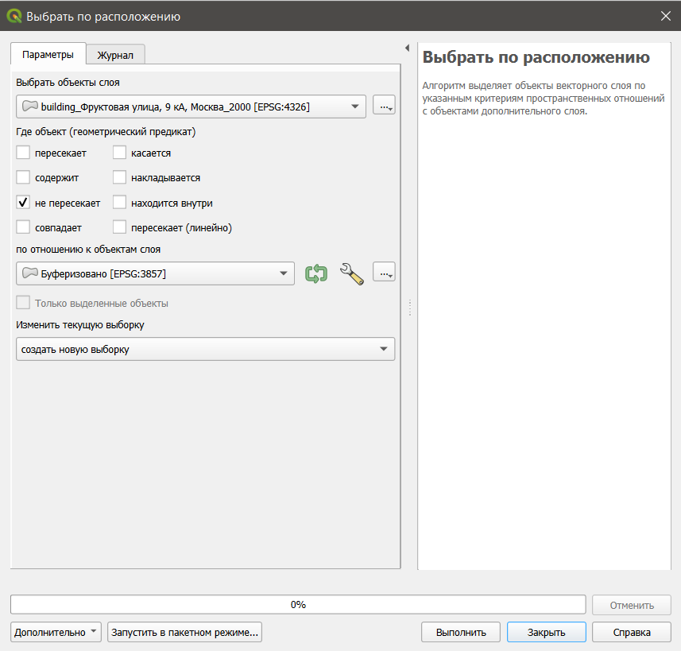
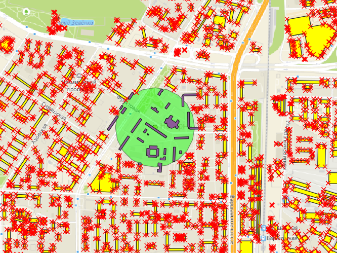

## **Добавляем в калькулятор полей**

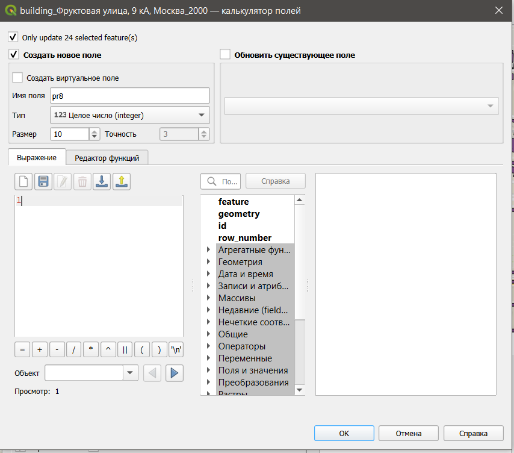
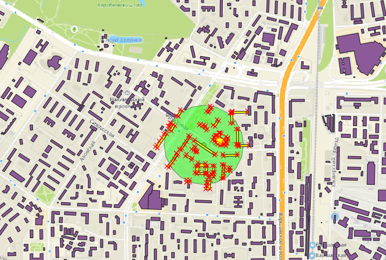
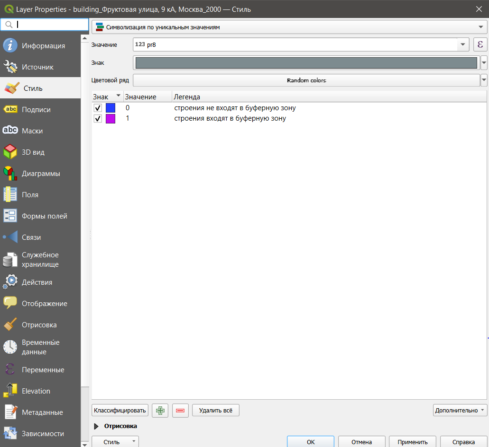
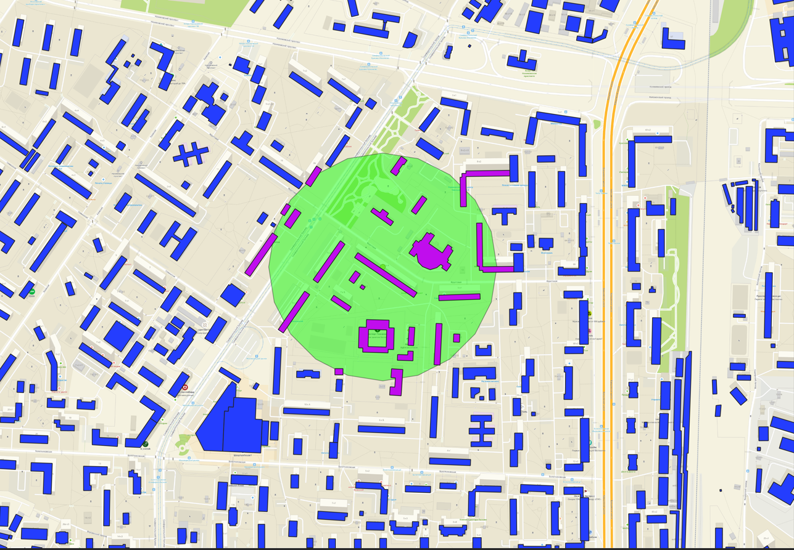

## **Макет**

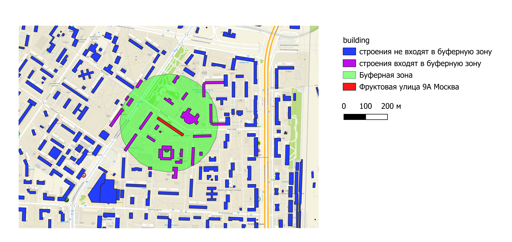