# Задание:

Представьте, что город хочет принять закон, запрещающий продавать алкоголь, в пределах 1000-метровой буферной зоны от учебного заведения. Создайте буфер длиной 1 км вокруг учебного заведения, и определите (выведите списком) сколько каких-либо магазинов с алкоголем попадают в эту зону.

# Вариант: Косинская ул., 24А, 111538

## **Добавляем на карту наш объект**

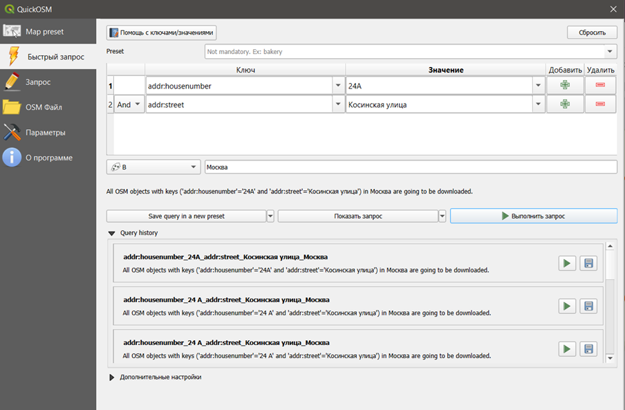
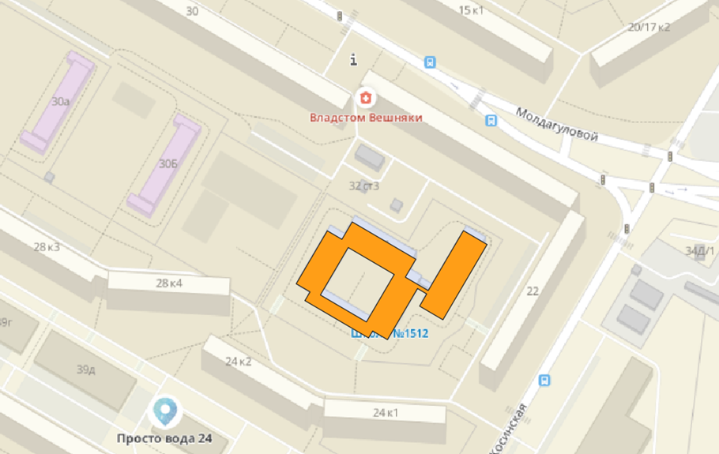

## **Создание буферной зоны**

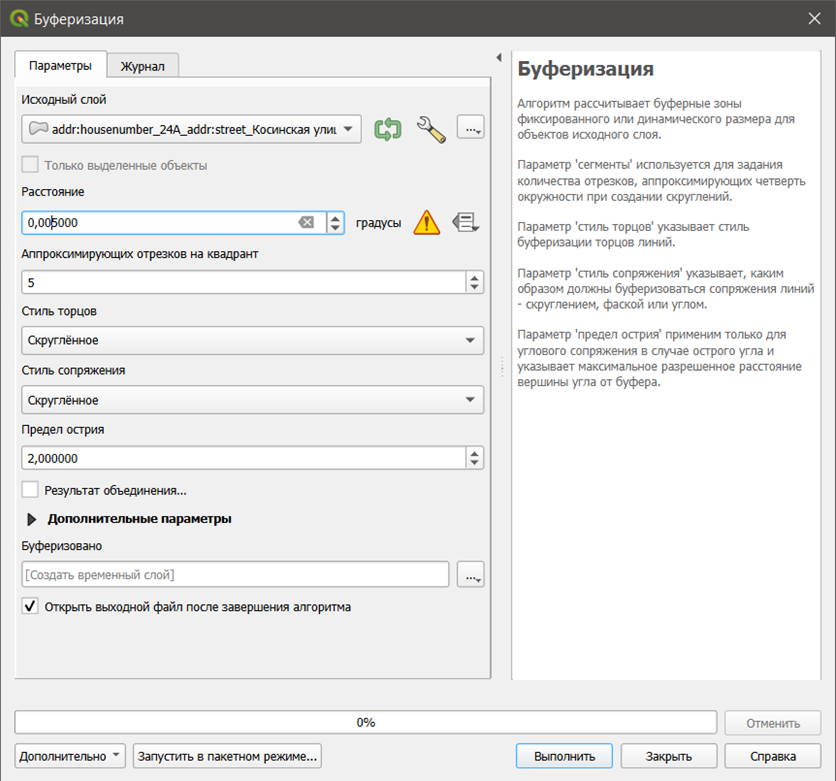
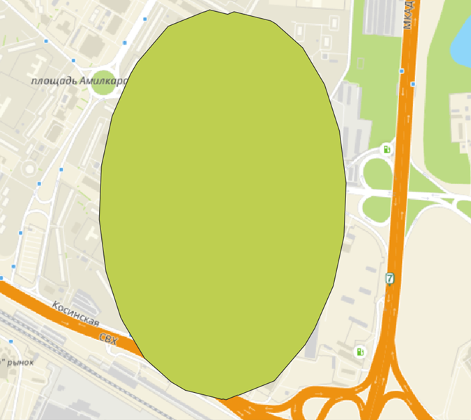

## **Добавляем магазины на карту**

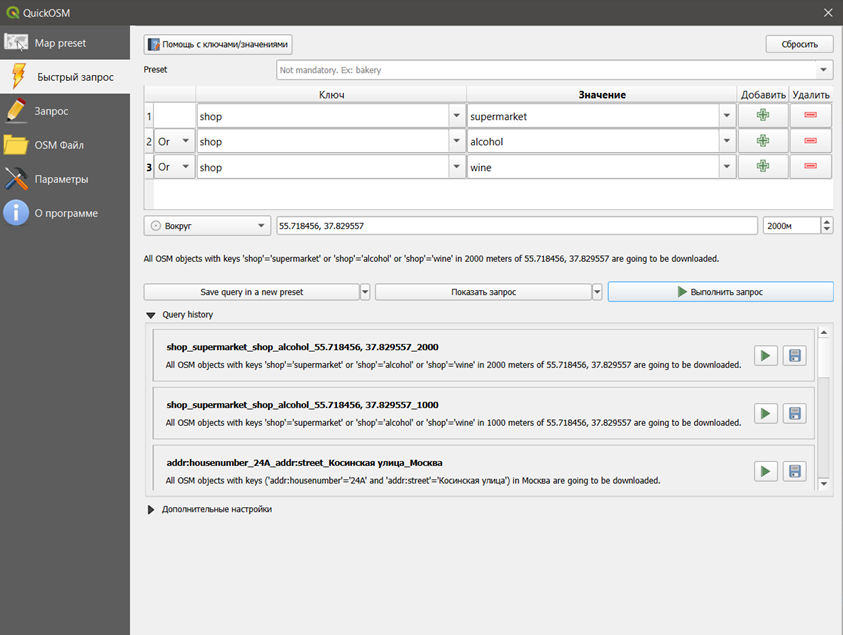
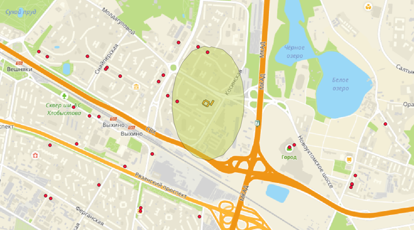

## **Выделяем магазины которые пересекают и не пересекают буферную зону**
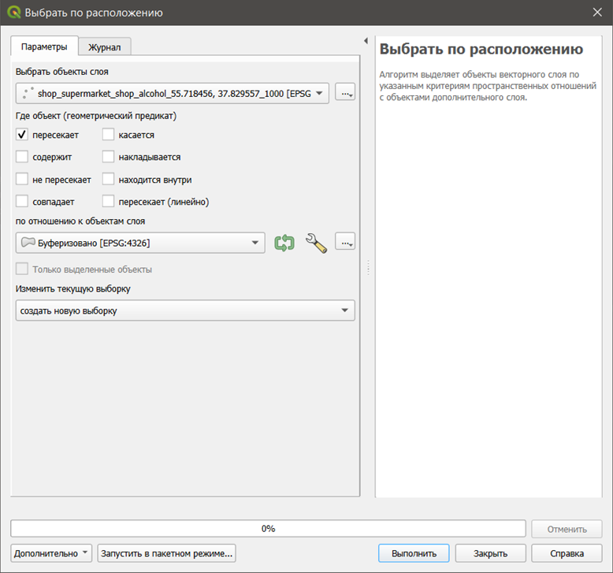
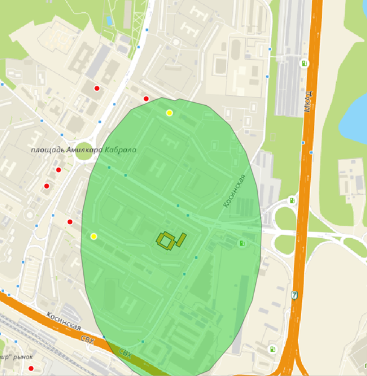
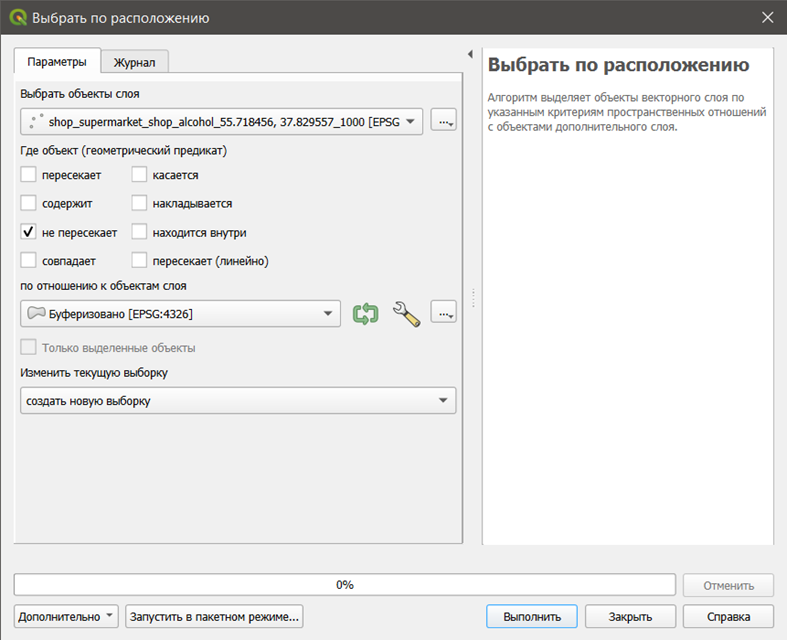
 

## **Добавляем в калькулятор полей со значениями 1 и 0**

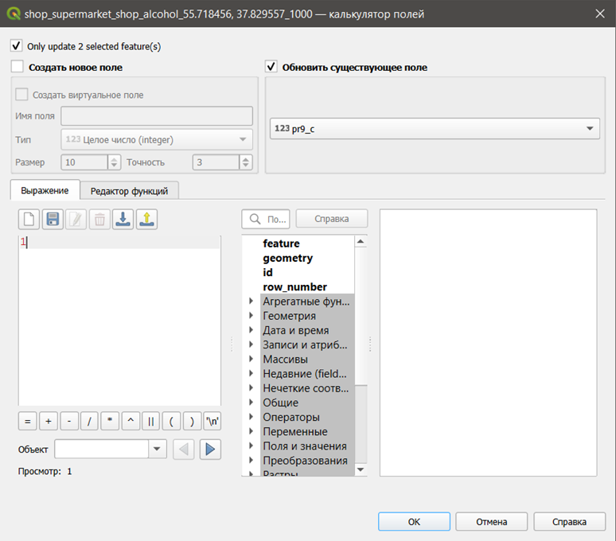
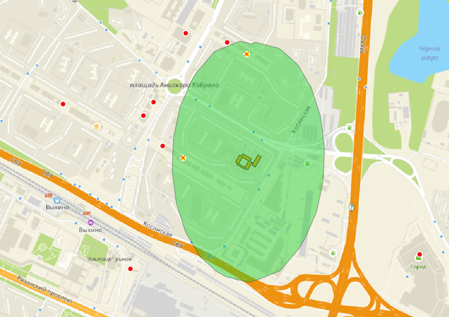
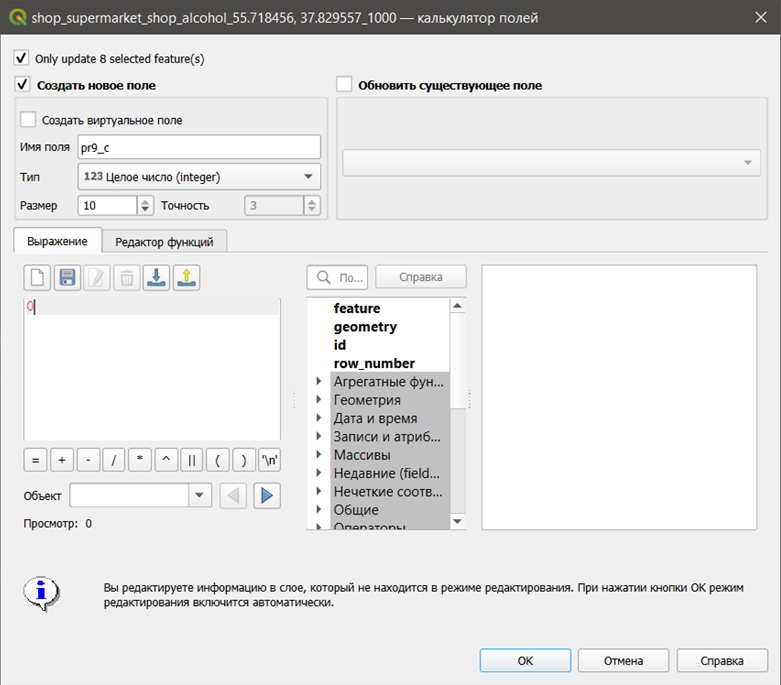
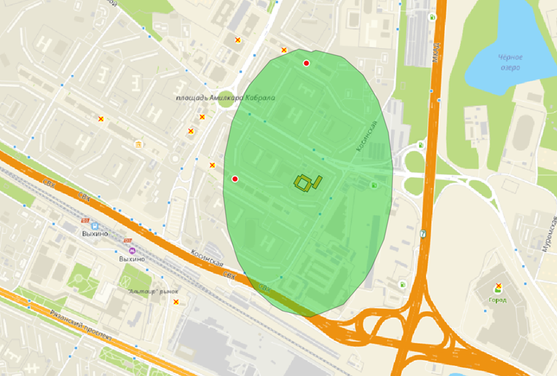
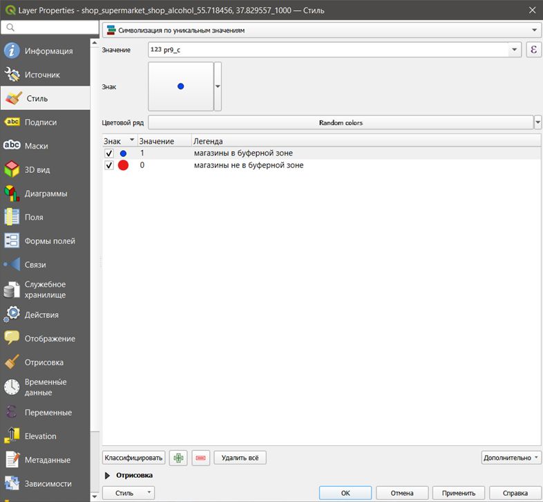

## **Макет**

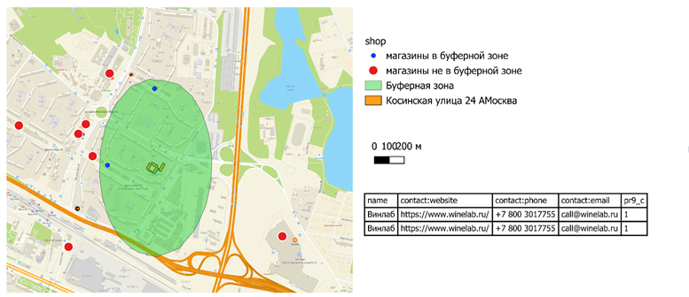